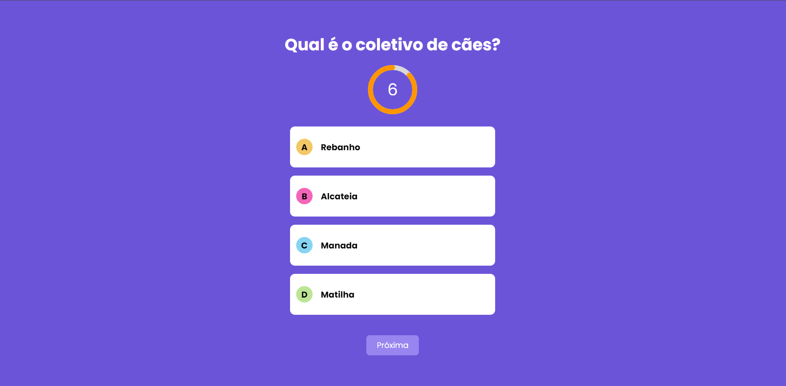
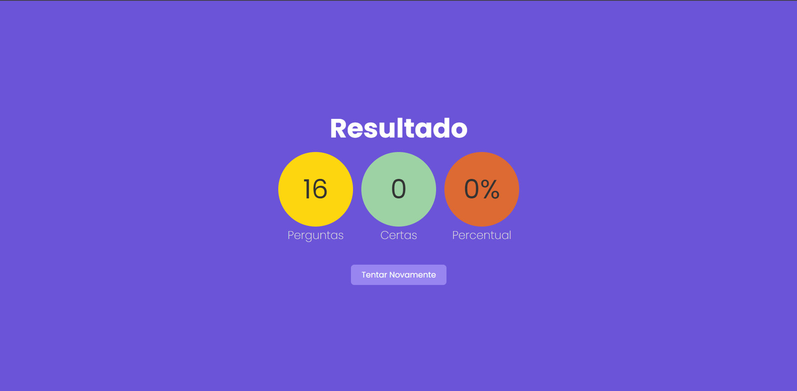

<!-- Make a readme -->

# Quiz 

## Description
This is a quiz where you can test your knowledge, this application is from a course
that i'm doing, the course is from Udemy, the course is called "Next.js e React - Curso Completo - Aprenda com Projetos"


## Main Screen


## Result Screen


## Technologies
Next.js
React.js
Typescript
CSS Modules
ESLint


## How to run
1. Clone this repository
2. Install dependencies
```bash
# Clone the repository
git clone https://github.com/xmurilo/projeto-quiz-nextjs.git

# Access the project folder
cd projeto-quiz-nextjs

# Install the dependencies
npm install

# Run the application
npm run dev

# The application will run on http://localhost:3000
```


# Author
| Name      | GitHub | Linkedin     |
|-----------|-------|------------|
| Murilo |   <a href="https://github.com/xmurilo">Github/Murilo</a>   | <a href="https://www.linkedin.com/in/murilo-silva-a85b7526b/"> Linkedin/Murilo </a> |